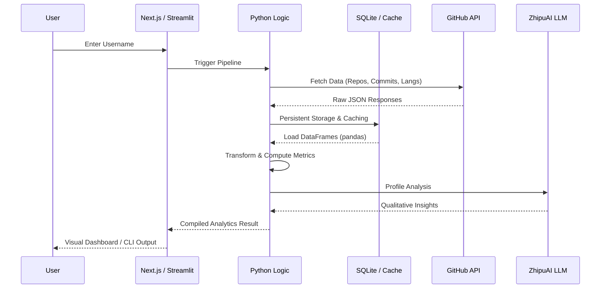

# GitScope

GitScope is a comprehensive tool for analyzing GitHub profiles and repository data. It was built as a data analyst portfolio project to demonstrate end-to-end data pipeline construction, from API collection and storage to advanced metrics and AI-driven insights.

## Architecture & Data Flow



## Tech Stack

- **Frontend**: Next.js (Pages), Bun, Tailwind CSS, Radix UI.
- **Data Engine**: Python 3.11+, pandas, SQLAlchemy, Pydantic.
- **Visualization**: Streamlit, Plotly, Rich (CLI).
- **Storage**: SQLite, local caching.
- **AI**: ZhipuAI (GLM-4).

## Getting Started

### 1. Prerequisites
- [Bun](https://bun.sh/) for the frontend.
- [Python 3.11+](https://www.python.org/) for the analytics engine.
- A GitHub Personal Access Token (to avoid rate limits).

### 2. Frontend Setup
```bash
bun install
bun run db:generate
bun run dev
```

### 3. Backend Setup
Navigate to the `gitscope` directory:
```bash
cd gitscope
python -m venv venv
source venv/bin/activate  # or venv\Scripts\activate on Windows
pip install -r requirements.txt
cp .env.example .env
```
*Make sure to add your `GITHUB_TOKEN` and optional `ZHIPUAI_API_KEY` to the `.env` file.*

## Usage

### CLI Analysis
Run the analyzer directly from the terminal:
```bash
python gitscope/main.py <github_username>
```

### Dashboard
Launch the interactive Streamlit UI:
```bash
cd gitscope
streamlit run app/streamlit_app.py
```

## Methodology
The analytical approach behind the metrics (Consistency, Quality, Impact, and Diversity) is documented in [gitscope/ANALYSIS.md](gitscope/ANALYSIS.md).

## License
MIT
